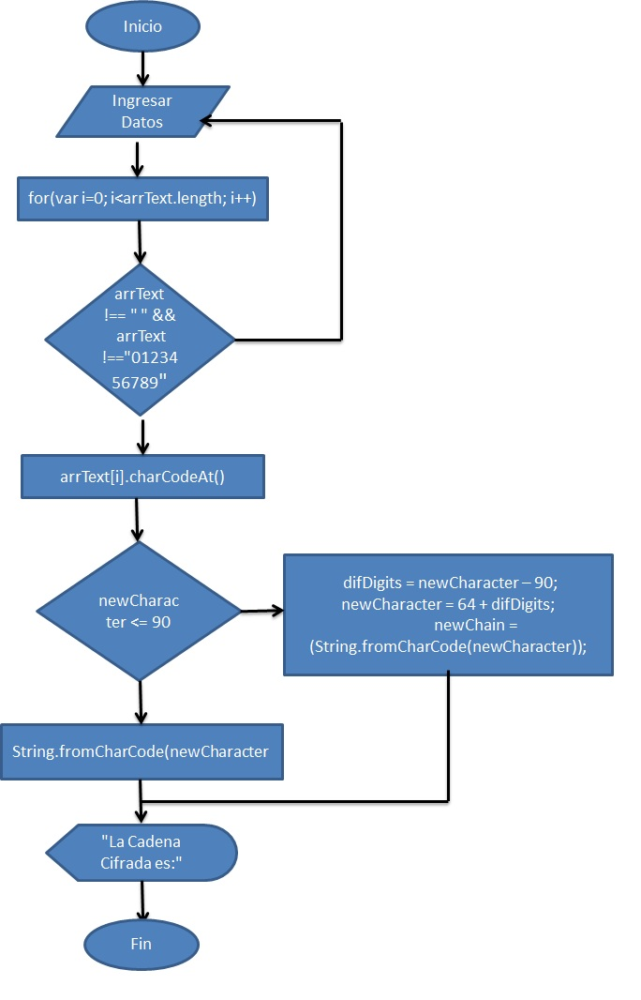

# Codigo Cesar
   Crea una web que pida, por medio de un prompt(), una frase al usuario y devuelva el mismo mensaje encriptado.

# Pseudocodigo
  1. Crear una funcion que reciba datos
  2. Ingresar datos (por el Usuario)
  3. Verificar los datos ingresados. 
      3.1 Si el usuario ingresa espacios (" "), el programa muestra una alerta. 
      3.2 Si el usuario ingresa nuemeros (0,1,2,3,4,5,6,7,8,9), el programa muestra una alerta. 
      3.3 Si se cumple uno de los 2 casos antes mencionados, regresar al paso 2.
  4. Comprobar los datos (letras). 
      4.1 En caso de introducir minusculas, mayusculas o minusculas con mayusculas, convertir todos los casos en mayusculas.
  5. Convertir la letras a codigo ASCII.
  6. Avanza (de la posicion ASCII) 7 espacios a la derecha. 
      6.1 Verificar si el numero ASCII es mayor a 90. 
          6.1.1 Restar 90 posiciones. 
          6.1.2 Colocados en la nueva posicion, Sumar 64 espacios. 
      6.2 Teniendo la posicon correspondiente, convertir el numero (ASCII) a letra.
  7. Mostrar en pantalla los datos encriptados.
  8. Fin.

# Diagrama de Flujo
  
